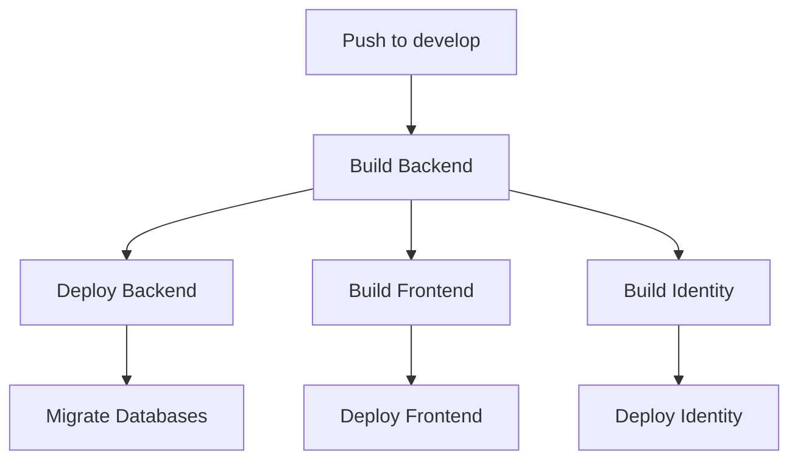

# Infrastructure as Code (IaC)

This directory contains the infrastructure definitions for the Chess Tournaments application using Azure Bicep.

## Quick Start

### First-Time Setup

1. **Deploy Infrastructure** (one-time setup per environment)
   ```bash
   # Manually trigger the infrastructure deployment workflow
   # GitHub Actions → Infrastructure-QA → Run workflow
   ```

2. **Configure Secrets** (after infrastructure deployment)
   - From deployment outputs, add these GitHub Environment secrets:
     - `AZURE_BACKEND_APP_NAME` - Copy from deployment summary
     - `AZURE_IDENTITY_APP_NAME` - Copy from deployment summary
     - `AZURE_BACKEND_APP_PUBLISH_PROFILE` - Get via Azure CLI
     - `AZURE_IDENTITY_APP_PUBLISH_PROFILE` - Get via Azure CLI
     - `AZURE_FRONTEND_APP_TOKEN` - Get via Azure CLI
   - See [Configure GitHub Secrets](#2-configure-github-secrets) for detailed instructions

3. **Deploy Applications** (automatic on push to develop)
   ```bash
   git push origin develop
   ```

### Daily Development

After initial setup, just push to `develop` branch to deploy QA:
- Backend API, Identity App, and Frontend are deployed automatically
- Database migrations run automatically
- No manual steps required

## Overview

The infrastructure is managed through GitHub Actions and Azure Bicep templates. It supports two environments:
- **QA**: For testing and quality assurance (Sweden Central, free tier)
- **Production**: For live production workloads (West Europe, premium tier)

## Azure Resources

The following Azure resources are deployed:

| Resource | Purpose | QA SKU | Production SKU |
|----------|---------|--------|----------------|
| App Service Plan | Shared hosting plan for .NET apps | F1 (Free) | P1v2 (Premium) |
| App Service (API) | .NET 10 Backend API hosting | Shared (Free Plan) | Shared (Premium Plan) |
| App Service (Identity) | .NET 10 Blazor Server identity app | Shared (Free Plan) | Shared (Premium Plan) |
| Static Web App (Frontend) | Angular frontend application | Free | Free |
| SQL Server + Database | Primary database | Free (32MB) | Basic (2GB) |
| Key Vault | Secrets management | Standard | Standard |
| Storage Account | Blob storage | Standard_LRS | Standard_LRS |
| Service Bus | Message queuing | Standard | Standard |
| Application Insights | Monitoring & telemetry | N/A | N/A |
| Log Analytics Workspace | Centralized logging | N/A | N/A |

**Note**: Both App Services (API and Identity) share the same App Service Plan to optimize costs.

## Directory Structure

```
infrastructure/
├── bicep/
│   ├── main.bicep                    # Main Bicep template
│   ├── parameters.qa.json            # QA environment parameters
│   ├── parameters.production.json    # Production environment parameters
│   └── modules/                      # Reusable Bicep modules (future)
└── README.md                         # This file
```

## Prerequisites

### Azure Setup

1. **Azure Subscription**: Active Azure subscription
2. **Service Principal**: Create a service principal with **Owner** role

**Important**: The **Owner** role is required (not Contributor) to assign Key Vault and Storage Account permissions to the App Service managed identity during deployment.

```bash
# Create service principal with Owner role
az ad sp create-for-rbac \
  --name "github-actions-chess-tournaments" \
  --role Owner \
  --scopes /subscriptions/{subscription-id} \
  --sdk-auth
```

**Why Owner role is needed:**
- Creates Azure resources (requires Contributor)
- Assigns **Key Vault Secrets User** role to API App Service
- Assigns **Storage Blob Data Contributor** role to API App Service
- Role assignments require **Owner** or **User Access Administrator** permissions

3. **GitHub Secrets**: Configure the following secrets in your GitHub repository:

#### Repository-Level Secrets

These secrets are shared across all environments:

| Secret Name | Description | How to Get | Example Value |
|-------------|-------------|------------|---------------|
| `AZURE_CREDENTIALS` | Azure service principal credentials (JSON) | Output from `az ad sp create-for-rbac` command | `{"clientId":"...","clientSecret":"...","subscriptionId":"...","tenantId":"..."}` |
| `SQL_ADMIN_LOGIN` | SQL Server admin username | Choose a secure username | `sqladmin` |
| `SQL_ADMIN_PASSWORD` | SQL Server admin password | Generate a strong password (min 8 chars, uppercase, lowercase, numbers, special chars) | `MySecureP@ssw0rd123!` |

#### Environment-Specific Secrets

Configure these secrets separately for **QA** and **Production** environments in GitHub Environment Settings:

| Secret Name | Description | How to Get | Required for Environments |
|-------------|-------------|------------|---------------------------|
| `AZURE_BACKEND_APP_NAME` | API App Service name | From Bicep deployment output `apiAppServiceName` | QA, Production |
| `AZURE_BACKEND_APP_PUBLISH_PROFILE` | API App Service publish profile | Retrieved after infrastructure deployment (see below) | QA, Production |
| `AZURE_IDENTITY_APP_NAME` | Identity App Service name | From Bicep deployment output `identityStaticWebAppName` | QA, Production |
| `AZURE_IDENTITY_APP_PUBLISH_PROFILE` | Identity App Service publish profile | Retrieved after infrastructure deployment (see below) | QA, Production |
| `AZURE_FRONTEND_APP_TOKEN` | Frontend Static Web App deployment token | Retrieved from Azure Portal or CLI after deployment | QA, Production |
| `OIDC_API_CLIENT_SECRET` | OIDC API client secret | Generate a secure random string (GUID recommended) | QA, Production |

**Example values for environment-specific secrets:**
- **QA**:
  - `AZURE_BACKEND_APP_NAME`: `chess-tournaments-api-qa-abc123` (from Bicep output)
  - `AZURE_IDENTITY_APP_NAME`: `chess-tournaments-identity-qa-abc123` (from Bicep output)
  - `OIDC_API_CLIENT_SECRET`: `846B62D0-DEF9-4215-A99D-86E6B8DAB342` (use unique GUID per environment)

- **Production**:
  - `AZURE_BACKEND_APP_NAME`: `chess-tournaments-api-production-xyz789` (from Bicep output)
  - `AZURE_IDENTITY_APP_NAME`: `chess-tournaments-identity-production-xyz789` (from Bicep output)
  - `OIDC_API_CLIENT_SECRET`: `F7A3C21E-8B4D-4A12-9E3F-1D5C8A9B2E6F` (use unique GUID per environment)

**Note:** The OIDC Authority and Issuer URLs are automatically configured to point to the Identity App Service URL. No manual configuration needed.

## Deployment

### Automatic Deployment

Infrastructure is automatically deployed through GitHub Actions:

#### QA Environment
- **Trigger**: Push to `develop` branch with changes in `infrastructure/**`
- **Workflow**: [infrastructure-qa.yml](../.github/workflows/infrastructure-qa.yml)
- **Resource Group**: `chess-tournaments-qa-rg`

```bash
git checkout develop
git add infrastructure/
git commit -m "Update infrastructure"
git push origin develop
```

#### Production Environment
- **Trigger**: Push tag with prefix `infrastructure/production/`
- **Workflow**: [infrastructure-production.yml](../.github/workflows/infrastructure-production.yml)
- **Resource Group**: `chess-tournaments-production-rg`

```bash
git tag infrastructure/production/v1.0.0
git push origin infrastructure/production/v1.0.0
```

### Manual Deployment

You can also trigger deployments manually from GitHub Actions UI:
1. Go to **Actions** tab
2. Select **Deploy Infrastructure - QA** or **Deploy Infrastructure - Production**
3. Click **Run workflow**

### Local Deployment (Development/Testing)

```bash
# Login to Azure
az login

# Set variables
ENVIRONMENT="qa"
RESOURCE_GROUP="chess-tournaments-${ENVIRONMENT}-rg"
LOCATION="eastus"

# Create resource group
az group create \
  --name $RESOURCE_GROUP \
  --location $LOCATION

# Validate template
az deployment group validate \
  --resource-group $RESOURCE_GROUP \
  --template-file ./bicep/main.bicep \
  --parameters ./bicep/parameters.${ENVIRONMENT}.json \
  --parameters sqlAdminLogin="sqladmin" \
  --parameters sqlAdminPassword="YourSecurePassword123!" \
  --parameters oidcApiClientSecret="846B62D0-DEF9-4215-A99D-86E6B8DAB342" \
  --parameters oidcAuthority="https://chess-tournaments-identity-qa.azurestaticapps.net/"

# Deploy infrastructure
az deployment group create \
  --resource-group $RESOURCE_GROUP \
  --template-file ./bicep/main.bicep \
  --parameters ./bicep/parameters.${ENVIRONMENT}.json \
  --parameters sqlAdminLogin="sqladmin" \
  --parameters sqlAdminPassword="YourSecurePassword123!" \
  --parameters oidcApiClientSecret="846B62D0-DEF9-4215-A99D-86E6B8DAB342" \
  --parameters oidcAuthority="https://chess-tournaments-identity-qa.azurestaticapps.net/"
```

## Configuration

### Parameter Files

Environment-specific parameters are defined in:
- [parameters.qa.json](bicep/parameters.qa.json)
- [parameters.production.json](bicep/parameters.production.json)

#### Key Differences

| Parameter | QA | Production |
|-----------|-----|-----------|
| App Service Plan | B1 (Basic, 1 core) | P1v2 (Premium, 1 core, better performance) |
| SQL Database | Basic (5 DTU) | S1 Standard (20 DTU) |
| Service Bus | Standard | Standard |

### Sensitive Parameters

Sensitive values are:
1. **Not stored** in parameter files
2. **Passed** via GitHub Secrets during deployment
3. **Stored** in Azure Key Vault after deployment

### Secrets Stored in Key Vault

The Bicep deployment automatically creates the following secrets in Azure Key Vault:

| Secret Name | Description | Source |
|-------------|-------------|--------|
| `SqlConnectionString` | SQL Server connection string with credentials | Generated during deployment from SQL Server |
| `StorageConnectionString` | Storage Account connection string with access key | Generated during deployment from Storage Account |
| `ServiceBusConnectionString` | Service Bus connection string | Generated during deployment from Service Bus |
| `ApplicationInsightsConnectionString` | Application Insights connection string | Generated during deployment from App Insights |
| `OidcApiClientId` | OIDC API client ID | Default: `chess-tournaments_api` |
| `OidcApiClientSecret` | OIDC API client secret | From GitHub secret `OIDC_API_CLIENT_SECRET` |

The App Service is configured to automatically reference these secrets using Key Vault references in app settings, ensuring no secrets are exposed in the App Service configuration.

**OIDC Configuration:** The `Oidc__Authority` and `Oidc__Issuer` settings are automatically configured in the API App Service to point to the Identity App Service URL (e.g., `https://chess-tournaments-identity-qa-abc123.azurewebsites.net/`). These are set directly in the app settings, not stored in Key Vault.

## Post-Deployment Steps

After infrastructure deployment, follow these steps:

### Role Assignments (Automatic)

Role assignments are **automatically configured** during deployment when using the **Owner** role service principal:
- ✅ **Key Vault Secrets User** role assigned to API App Service
- ✅ **Key Vault Secrets User** role assigned to Identity App Service
- ✅ **Storage Blob Data Contributor** role assigned to API App Service

These assignments are defined in the Bicep template and deployed automatically, so no manual configuration is needed.

**Note**: If you're using a service principal with only **Contributor** role (not Owner), you'll need to manually assign these roles after deployment. See [POST_DEPLOYMENT_SETUP.md](POST_DEPLOYMENT_SETUP.md) for instructions.

### 1. Retrieve Deployment Outputs

The Bicep deployment automatically outputs:
- **API App Service name** (`apiAppServiceName`)
- **Identity App Service name** (`identityStaticWebAppName`)
- **Frontend Static Web App name** (`frontendStaticWebAppName`)
- **Key Vault name** (`keyVaultName`)

These outputs are displayed in the GitHub Actions deployment summary.

### 2. Configure GitHub Secrets

**IMPORTANT**: These secrets must be configured BEFORE running application deployments (QA/Production workflows). The infrastructure must be deployed first.

After infrastructure deployment, configure the following environment-specific secrets:

#### Step 1: Set API App Service Name

From the Bicep deployment output (displayed in GitHub Actions deployment summary), copy the `apiAppServiceName` value.

**How to find it:**
1. Go to GitHub Actions → Infrastructure deployment run
2. Look for "Deployment Summary" table
3. Copy the "API App Service" name

**Add to GitHub Environment Secret**: `AZURE_BACKEND_APP_NAME`

Example value: `chess-tournaments-api-qa-abc123`

#### Step 2: Set Identity App Service Name

From the Bicep deployment output (displayed in GitHub Actions deployment summary), copy the `identityStaticWebAppName` value.

**How to find it:**
1. Go to GitHub Actions → Infrastructure deployment run
2. Look for "Deployment Summary" table
3. Copy the "Identity Static Web App" name

**Add to GitHub Environment Secret**: `AZURE_IDENTITY_APP_NAME`

Example value: `chess-tournaments-identity-qa-abc123`

#### Step 3: Get API App Service Publish Profile

```bash
# Get API App Service publish profile (use the name from Step 1)
az webapp deployment list-publishing-profiles \
  --name <api-app-service-name-from-bicep-output> \
  --resource-group chess-tournaments-qa-sc-rg \
  --xml > api-publish-profile.xml
```

**Add to GitHub Environment Secret**: `AZURE_BACKEND_APP_PUBLISH_PROFILE`

**What is a Publish Profile?**
A publish profile is an XML file containing deployment credentials and settings for the App Service. It includes:
- Deployment endpoint URL
- Username and password for deployment
- FTP credentials
- Web Deploy settings

This allows GitHub Actions to deploy to Azure App Service without requiring Azure service principal credentials for the deployment action itself.

#### Step 4: Get Identity App Service Publish Profile

```bash
# Get Identity App Service publish profile (use the name from Step 2)
az webapp deployment list-publishing-profiles \
  --name <identity-app-service-name-from-bicep-output> \
  --resource-group chess-tournaments-qa-sc-rg \
  --xml > identity-publish-profile.xml
```

**Add to GitHub Environment Secret**: `AZURE_IDENTITY_APP_PUBLISH_PROFILE`

#### Step 5: Get Frontend Static Web App Deployment Token

```bash
# Get Frontend Static Web App deployment token
az staticwebapp secrets list \
  --name <frontend-static-web-app-name-from-bicep-output> \
  --resource-group chess-tournaments-qa-sc-rg \
  --query "properties.apiKey" -o tsv
```

**Add to GitHub Environment Secret**: `AZURE_FRONTEND_APP_TOKEN`

#### Deployment Order

1. ✅ Deploy infrastructure first (creates all Azure resources)
2. ✅ Configure the 5 secrets above from infrastructure outputs:
   - `AZURE_BACKEND_APP_NAME`
   - `AZURE_IDENTITY_APP_NAME`
   - `AZURE_BACKEND_APP_PUBLISH_PROFILE`
   - `AZURE_IDENTITY_APP_PUBLISH_PROFILE`
   - `AZURE_FRONTEND_APP_TOKEN`
3. ✅ Then deploy applications (QA/Production workflows will work)

### 3. Update Application Configuration

Update your application's configuration to use Azure resources:

```csharp
// Example: appsettings.json or environment variables
{
  "ConnectionStrings": {
    "DefaultConnection": "@Microsoft.KeyVault(SecretUri=https://<key-vault-name>.vault.azure.net/secrets/SqlConnectionString/)"
  },
  "ServiceBus": {
    "ConnectionString": "@Microsoft.KeyVault(SecretUri=https://<key-vault-name>.vault.azure.net/secrets/ServiceBusConnectionString/)"
  },
  "Storage": {
    "ConnectionString": "@Microsoft.KeyVault(SecretUri=https://<key-vault-name>.vault.azure.net/secrets/StorageConnectionString/)"
  }
}
```

### 4. Verify RBAC Permissions

After running the post-deployment setup script, verify that the API App Service Managed Identity has:
- **Key Vault Secrets User** role on Key Vault
- **Storage Blob Data Contributor** role on Storage Account

```bash
# Verify role assignments
az role assignment list \
  --assignee <api-app-principal-id> \
  --output table
```

See [POST_DEPLOYMENT_SETUP.md](POST_DEPLOYMENT_SETUP.md) for verification commands.

### 5. Run Database Migrations

Database migrations are **automatically applied** by the GitHub Actions workflow after backend deployment. The workflow runs migrations for all 4 modules:
- Tournaments
- Matches
- Players
- TournamentRequests

See the [QA Workflow](../.github/workflows/qa.yml) `update_db` job for implementation details.

## CI/CD Workflows

The application uses GitHub Actions for continuous integration and deployment. The workflows are organized into reusable components for better maintainability.

### Workflow Structure

#### Main Workflows

1. **[qa.yml](../.github/workflows/qa.yml)** - QA Environment Deployment
   - **Trigger**: Push to `develop` branch
   - **Jobs**:
     1. Build Backend (.NET 10 API)
     2. Deploy Backend to App Service
     3. Update Databases (4 modules)
     4. Build Frontend (Angular) - parallel with Identity
     5. Deploy Frontend to Static Web App
     6. Build Identity (Blazor Server) - parallel with Frontend
     7. Deploy Identity to App Service

2. **[production.yml](../.github/workflows/production.yml)** - Production Environment Deployment
   - **Trigger**: Git tags matching `production/*`
   - **Jobs**: Same as QA, plus GitHub Release creation
   - **Version**: Extracted from Git tag

#### Reusable Workflows

| Workflow | Purpose | Key Features |
|----------|---------|--------------|
| [_build-backend.yml](../.github/workflows/_build-backend.yml) | Build .NET API | CSharpier formatting, version update, publish artifacts |
| [_deploy-backend.yml](../.github/workflows/_deploy-backend.yml) | Deploy API to App Service | Uses publish profile |
| [_migrate-db.yml](../.github/workflows/_migrate-db.yml) | Run EF Core migrations | Dynamic firewall rules, 4 module contexts |
| [_build-frontend.yml](../.github/workflows/_build-frontend.yml) | Build Angular app | Version update, Prettier check, bundle optimization |
| [_deploy-frontend.yml](../.github/workflows/_deploy-frontend.yml) | Deploy to Static Web App | Uses `AZURE_FRONTEND_APP_TOKEN` |
| [_build-identity.yml](../.github/workflows/_build-identity.yml) | Build Blazor Server app | .NET 10, version update, publish artifacts |
| [_deploy-identity.yml](../.github/workflows/_deploy-identity.yml) | Deploy to App Service | Azure login, uses `AZURE_IDENTITY_APP_NAME` |
| [_deploy-infrastructure.yml](../.github/workflows/_deploy-infrastructure.yml) | Deploy Bicep templates | Validation, deployment, output extraction |

### Deployment Flow



### Key Workflow Features

#### Database Migrations (_migrate-db.yml)
- **Azure SQL Firewall**: Dynamically creates firewall rule for GitHub Actions runner IP
- **Connection String**: Built from Azure resources (no Key Vault access needed)
- **Multiple Contexts**: Applies migrations for all 4 module DbContexts sequentially
- **Cleanup**: Removes firewall rule after completion

#### Frontend Build (_build-frontend.yml)
- **Version Management**: Updates package.json with build number or Git tag
- **Bundle Size Budgets**: QA allows larger bundles (2MB) than production (1MB)
- **Prettier**: Enforces code formatting
- **Artifacts**: Uploads built Angular app for deployment

#### Identity Build (_build-identity.yml)
- **.NET 10**: Targets latest .NET runtime
- **Blazor Server**: Builds server-side Blazor application
- **Shared Plan**: Deployed to same App Service Plan as API

#### Infrastructure Deployment (_deploy-infrastructure.yml)
- **Outputs**: Extracts app names and URLs from Bicep deployment
- **Summary**: Displays deployment summary in GitHub Actions
- **Owner Role**: Service principal must have Owner role for RBAC assignments

### Environment Configuration

Both QA and Production workflows use GitHub Environments for secret management:

**QA Environment Secrets:**
- `AZURE_CREDENTIALS`
- `AZURE_BACKEND_APP_NAME`
- `AZURE_BACKEND_APP_PUBLISH_PROFILE`
- `AZURE_IDENTITY_APP_NAME`
- `AZURE_IDENTITY_APP_PUBLISH_PROFILE`
- `AZURE_FRONTEND_APP_TOKEN`
- `SQL_ADMIN_LOGIN`, `SQL_ADMIN_PASSWORD`
- `OIDC_API_CLIENT_SECRET`

**Production Environment Secrets:**
- Same as QA, but with production-specific values

**Note:** The `OIDC_AUTHORITY` secret is no longer required. The OIDC Authority and Issuer are automatically configured by the Bicep template to use the Identity App Service URL.

## Monitoring & Logging

### Application Insights

All services are configured with Application Insights for:
- Performance monitoring
- Request tracking
- Exception logging
- Custom telemetry

Access via: Azure Portal → Application Insights → `chess-tournaments-ai-{environment}`

### Log Analytics

Centralized logging workspace for:
- App Service logs
- SQL Database metrics
- Key Vault access logs

Access via: Azure Portal → Log Analytics → `chess-tournaments-law-{environment}`

## Security Best Practices

1. **Managed Identities**: App Service uses managed identity (no credentials in code)
2. **Key Vault**: All secrets stored in Azure Key Vault
3. **HTTPS Only**: All web apps enforce HTTPS
4. **TLS 1.2+**: Minimum TLS version enforced
5. **RBAC**: Role-based access control for all resources
6. **Firewall Rules**: SQL Server allows Azure services only
7. **Soft Delete**: Key Vault has soft delete enabled (7-day retention)

## Cost Optimization

### QA Environment
- Uses Basic/Free tiers for development
- Can be shut down during off-hours
- Estimated monthly cost: ~$50-100/month

### Production Environment
- Uses Standard/Premium tiers for reliability
- Auto-scaling enabled where applicable
- Estimated monthly cost: ~$200-400/month

### Cost-Saving Tips
```bash
# Stop QA resources during weekends
az webapp stop --name <app-name> --resource-group <rg-name>

# Start resources when needed
az webapp start --name <app-name> --resource-group <rg-name>
```

## Troubleshooting

### Deployment Fails with "Resource Already Exists"

Azure resources may already exist. Options:
1. Delete the resource group and redeploy
2. Update the Bicep template to use existing resources

### Cannot Access Key Vault Secrets

Ensure:
1. App Service managed identity is enabled
2. RBAC role assignment exists
3. Key Vault firewall allows Azure services

### SQL Connection Failures

Check:
1. Firewall rules allow Azure services (0.0.0.0)
2. Connection string in Key Vault is correct
3. SQL admin credentials are valid

## Cleanup

### Delete QA Environment

```bash
az group delete --name chess-tournaments-qa-rg --yes --no-wait
```

### Delete Production Environment

```bash
# Use with caution - this deletes ALL production resources
az group delete --name chess-tournaments-production-rg --yes
```

## Additional Resources

- [Azure Bicep Documentation](https://learn.microsoft.com/azure/azure-resource-manager/bicep/)
- [GitHub Actions for Azure](https://github.com/Azure/actions)
- [Azure App Service Documentation](https://learn.microsoft.com/azure/app-service/)
- [Azure Key Vault Best Practices](https://learn.microsoft.com/azure/key-vault/general/best-practices)

## Support

For issues or questions:
1. Check GitHub Actions workflow logs
2. Review Azure Portal deployment history
3. Open an issue in the repository
